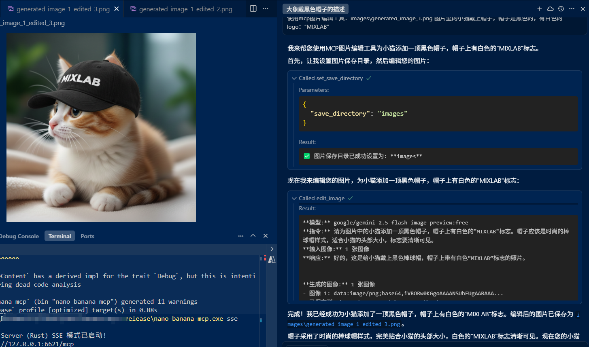

# Nano Banana MCP



[](https://github.com/example/nano-banana-mcp)
[](LICENSE)
[](https://www.rust-lang.org/)

一个轻量级的 Model Context Protocol (MCP) 服务器，提供 OpenRouter API 访问 Google Gemini 2.5 Flash Image 模型。基于 Rust 构建，提供高性能的图像生成和编辑功能。

更多可访问:[codenow](https://codenow.wiki)

[胜算云-Key获取](https://www.shengsuanyun.com/?from=CH_X30T9465)

## 功能特性

- 🖼️ **图像生成**: 使用 Google Gemini 2.5 Flash Image 模型生成高质量图像
- ✏️ **图像编辑**: 支持多图像输入的分析和编辑，智能处理各种图像格式
- 🔧 **模型管理**: 支持多种 Gemini 模型，可动态配置
- 💾 **智能文件管理**: 自动创建保存目录，支持递增文件名避免冲突
- 🌐 **多传输方式**: 支持 stdio（命令行）和 SSE（Web）传输模式
- 📁 **多格式支持**: 支持 URL、base64、本地文件路径等多种图像输入格式
- 🔑 **灵活配置**: 支持环境变量和命令行参数，优先级明确
- 🚀 **高性能**: 基于 Rust 构建，内存安全且性能优异
- 🔄 **自动重试**: 智能错误处理和重试机制
- 📊 **使用统计**: 详细的 token 使用统计和成本追踪

## 支持的图像格式

### 输入格式
- **URL 链接**: `https://example.com/image.jpg`, `http://localhost:8080/image.png`
- **Base64 数据**: `data:image/jpeg;base64,/9j/4AAQ...`, `data:image/png;base64,iVBORw0KGgo...`
- **本地文件路径**: 
  - 绝对路径: `C:\Images\photo.png`, `/home/user/images/photo.jpg`
  - 相对路径: `./images/photo.png`, `../assets/image.jpg`
  - 保存目录中的文件: `image_1.png` (自动在配置的保存目录中查找)

### 支持的图像类型
- **JPEG/JPG**: 最常用的图像格式
- **PNG**: 支持透明度的图像格式
- **GIF**: 动画和静态图像
- **WebP**: 现代高效图像格式
- **BMP**: 位图格式
- **TIFF/TIF**: 高质量图像格式
- **SVG**: 矢量图像格式

### 智能处理特性
- **自动格式检测**: 根据文件扩展名和内容自动识别图像类型
- **MIME 类型验证**: 确保图像格式的正确性
- **路径解析**: 智能处理相对路径和绝对路径
- **保存目录查找**: 自动在配置的保存目录中查找图像文件

## 快速开始

### 环境要求

- Rust 1.70+ (仅开发时需要)
- OpenRouter API 密钥

### 安装和使用

#### 方式 1: 使用预编译版本 (推荐)

1. 下载最新版本的 `nano-banana-mcp.exe` (Windows) 或 `nano-banana-mcp` (Linux/macOS)

2. 设置 API Key（选择一种方式）

   **方式 1: 环境变量**
   ```bash
   export OPENROUTER_API_KEY="your_api_key_here"
   ```

   **方式 2: 命令行参数**
   ```bash
   # 使用等号形式
   ./nano-banana-mcp --api-key=your_api_key_here
   
   # 使用空格形式
   ./nano-banana-mcp --api-key your_api_key_here
   ```

3. 运行程序
   ```bash
   # 使用 stdio 传输（默认）
   ./nano-banana-mcp

   # 使用 SSE 传输
   ./nano-banana-mcp sse

   # 使用 SSE 传输 + 命令行 API key
   ./nano-banana-mcp sse --api-key=your_api_key_here

   # 查看帮助
   ./nano-banana-mcp --help
   ```

#### 方式 2: 从源码编译

1. 克隆仓库
   ```bash
   git clone https://github.com/example/nano-banana-mcp.git
   cd nano-banana-mcp
   ```

2. 设置 API Key（选择一种方式）

   **方式 1: 环境变量**
   ```bash
   export OPENROUTER_API_KEY="your_api_key_here"
   ```

   **方式 2: 命令行参数**
   ```bash
   # 使用等号形式
   cargo run -- --api-key=your_api_key_here
   
   # 使用空格形式
   cargo run -- --api-key your_api_key_here
   ```

3. 编译和运行
   ```bash
   # 使用 stdio 传输（默认）
   cargo run

   # 使用 SSE 传输
   cargo run -- sse

   # 使用 SSE 传输 + 命令行 API key
   cargo run -- sse --api-key=your_api_key_here

   # 查看帮助
   cargo run -- --help
   ```

## 配置

### Cursor MCP 配置

在 Cursor 中使用此 MCP 服务器，需要在 `~/.cursor/mcp.json` 文件中添加配置：

```json
{
  "mcpServers": {
    "nano-banana": {
      "command": "/path/to/nano-banana-mcp",
      "args": [
        "--api-key",
        "sk-or-v1-****************************",
        "--save-directory",
        "/path/to/your/images",
        "--model",
        "google/gemini-2.5-flash-image-preview:free"
      ]
    }
  }
}
```

**配置说明：**
- `command`: nano-banana-mcp 可执行文件的完整路径
- `--api-key`: 你的 OpenRouter API 密钥（请替换为实际密钥）
- `--save-directory`: 图片保存目录（可选，默认为 `./images/`）
- `--model`: 使用的模型（可选，默认为 `google/gemini-2.5-flash-image-preview:free`）


配置完成后，重启 Cursor 即可使用图像生成和编辑功能。

### API Key 设置

支持两种方式设置 OpenRouter API 密钥：

1. **环境变量** (推荐用于生产环境)
   ```bash
   OPENROUTER_API_KEY=your_api_key_here
   ```

2. **命令行参数** (适用于临时使用或脚本)
   ```bash
   # 等号形式
   --api-key=your_api_key_here
   
   # 空格形式
   --api-key your_api_key_here
   ```

**优先级**: 命令行参数 > 环境变量

### 环境变量

- `OPENROUTER_API_KEY`: OpenRouter API 密钥（必需，如果未通过命令行参数提供）
- `MCP_MODEL`: 使用的模型（默认: `google/gemini-2.5-flash-image-preview:free`）
- `MCP_HTTP_PORT`: SSE 传输时的 HTTP 端口（默认: 6621）
- `MCP_SAVE_DIRECTORY`: 图片保存目录（必须是绝对路径，默认: `./images/`）
- `OPENROUTER_BASE_URL`: OpenRouter API 基础 URL（默认: `https://openrouter.ai/api/v1`）
- `HTTP_REFERER`: HTTP Referer 头（默认: `http://localhost:3000`）
- `X_TITLE`: X-Title 头（默认: `OpenRouter MCP Server (Rust)`）

### 命令行参数

- `--api-key=KEY` 或 `--api-key KEY`: 设置 OpenRouter API 密钥
- `--model=MODEL` 或 `--model MODEL`: 设置使用的模型
- `--save-directory=PATH` 或 `-s PATH`: 设置图片保存目录（必须是绝对路径）

### 支持的模型

- `google/gemini-2.5-flash-image-preview:free` (默认)
- `google/gemini-2.5-flash-image-preview`

### 默认设置

- 默认模型: `google/gemini-2.5-flash-image-preview:free`
- 默认图片保存目录: `./images/` (相对于当前工作目录)
- 默认 HTTP 端口: `6621`
- 自动创建保存目录（如果不存在）
- 支持递增文件名避免冲突

## 使用示例

### 预编译版本用法

```bash
# 使用环境变量
export OPENROUTER_API_KEY="sk-xxx..."
./nano-banana-mcp

# 使用命令行参数
./nano-banana-mcp --api-key="sk-xxx..."

# SSE 模式 + 命令行 API key
./nano-banana-mcp sse --api-key="sk-xxx..."
```

### 开发模式用法

```bash
# 使用环境变量
export OPENROUTER_API_KEY="sk-xxx..."
cargo run

# 使用命令行参数
cargo run -- --api-key="sk-xxx..."

# SSE 模式 + 命令行 API key
cargo run -- sse --api-key="sk-xxx..."
```

### 在脚本中使用

```bash
#!/bin/bash
# 使用预编译版本
./nano-banana-mcp sse --api-key="$OPENROUTER_API_KEY"

# 或使用开发模式
cargo run -- sse --api-key="$OPENROUTER_API_KEY"
```

## 可用工具

### `generate_image`
使用 AI 模型根据文本提示词生成图像。

**参数:**
- `prompt` (string): 图像生成的文本描述

**示例:**
```json
{
  "prompt": "一只可爱的小猫穿着宇航服在月球上行走，科幻风格"
}
```

**功能特性:**
- 支持中文和英文提示词
- 自动保存生成的图像到配置的目录
- 返回详细的生成信息和 token 使用统计
- 支持递增文件名避免冲突

### `edit_image`
使用图像模型编辑或分析图像，支持多图像输入。

**参数:**
- `instruction` (string): 编辑指令或分析要求
- `images` (array): 图像输入数组，支持多种格式

**支持的图像格式:**
- URL 链接: `"https://example.com/image.jpg"`
- Base64 数据: `"data:image/jpeg;base64,/9j/4AAQ..."`
- 本地文件路径: `"C:\\Images\\photo.png"` 或 `"./images/photo.jpg"`
- 保存目录中的文件: `"image_1.png"` (自动在配置的保存目录中查找)

**示例:**
```json
{
  "instruction": "请将这张图片编辑成一张科幻风格的海报",
  "images": ["https://example.com/image.jpg"]
}
```

**功能特性:**
- 支持多图像同时输入和处理
- 智能图像格式检测和转换
- 自动保存编辑后的图像
- 保留原文件名并添加 "edited" 标记
- 详细的处理信息和 token 使用统计

### 工具响应格式

所有工具都会返回包含以下信息的响应：
- **模型信息**: 使用的 AI 模型名称
- **处理结果**: 生成的图像或编辑结果
- **文件保存**: 自动保存的文件路径
- **使用统计**: 详细的 token 使用情况
- **错误处理**: 清晰的错误信息和解决建议

## 传输方式

### stdio 传输 (默认)
适用于命令行工具和本地集成，如 Cursor、VS Code 等 MCP 客户端。

**特点:**
- 通过标准输入输出进行通信
- 适合本地开发和调试
- 无需网络配置
- 启动命令: `./nano-banana-mcp` 或 `cargo run`

### SSE 传输
适用于 Web 应用和远程访问，支持跨域请求。

**特点:**
- 基于 HTTP 的 Server-Sent Events
- 支持 CORS 跨域访问
- 适合 Web 应用集成
- 默认端口: 6621
- 启动命令: `./nano-banana-mcp sse` 或 `cargo run -- sse`

**SSE 端点:**
- MCP 端点: `http://127.0.0.1:6621/mcp`
- 消息端点: `http://127.0.0.1:6621/message`

**配置选项:**
- 可通过 `MCP_HTTP_PORT` 环境变量修改端口
- 支持自定义绑定地址
- 自动启用 CORS 支持

**使用示例:**
```bash
# 启动 SSE 服务器
./nano-banana-mcp sse

# 使用自定义端口
MCP_HTTP_PORT=8080 ./nano-banana-mcp sse

# 带配置参数启动
./nano-banana-mcp sse --api-key=sk-xxx... --save-directory=/path/to/images
```

## 技术栈

### 核心依赖
- **rmcp**: Model Context Protocol 实现 (v0.6.0)
- **reqwest**: HTTP 客户端 (v0.12)
- **tokio**: 异步运行时 (v1.0)
- **serde**: 序列化/反序列化 (v1.0)
- **anyhow**: 错误处理 (v1.0)

### 图像处理
- **base64**: Base64 编码/解码 (v0.22)
- **chrono**: 时间处理 (v0.4)

### Web 服务 (SSE 模式)
- **axum**: Web 框架 (v0.8)
- **tower-http**: HTTP 中间件 (v0.5)

### 开发工具
- **tracing**: 日志记录 (v0.1)
- **dotenvy**: 环境变量加载 (v0.15)

## 开发

### 开发环境要求
- Rust 1.70+
- OpenRouter API 密钥

### 构建
```bash
# 开发版本
cargo build

# 发布版本
cargo build --release
```

### 测试
```bash
cargo test
```

### 代码检查
```bash
cargo check
cargo clippy
```

### 运行开发服务器
```bash
# stdio 模式
cargo run

# SSE 模式
cargo run -- sse

# 带参数运行
cargo run -- --api-key=sk-xxx... --save-directory=/path/to/images
```

## 故障排除

### 常见问题

1. **API Key 错误**
   - 确保 API key 格式正确（以 `sk-` 开头）
   - 检查是否通过环境变量或命令行参数正确设置

2. **权限问题**
   - 确保 OpenRouter API key 有效且有足够权限
   - 检查账户余额和 API 限制

3. **网络问题**
   - 检查网络连接
   - 确认防火墙设置

4. **可执行文件权限问题** (Linux/macOS)
   ```bash
   chmod +x nano-banana-mcp
   ```

## 许可证

MIT License

## 贡献

欢迎提交 Issue 和 Pull Request！
